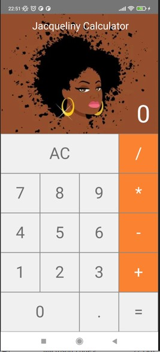

# Project Calculator

basic experimental design calculator

## Description
Jaquelyne Calculator is a project developed for logic training and mobile development.
The main functionality is to perform basic calculations implemented in a calculator, and the image was in honor of a friend lol.



## Prerequisites

✔ - Node.js

✔ - React Native

✔ - XCode // for run ios simulator

✔ - Android Studio // for run android simulator

## Quick Start

```
  
  git clone https://github.com/leandro-SI/calculator-app-react-native
  
  cd calculator-app-react-native
  
  npx react-native 
  
  // choose "run-android" to run on android or "run-ios" to run on ios
```